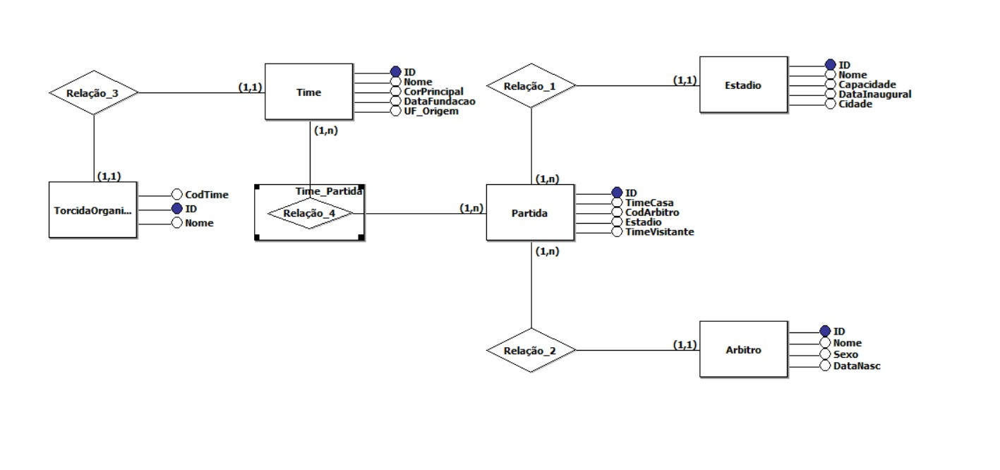

# ⚽ Sistema de Banco de Dados para Campeonato de Futebol

**Universidade:** Universidade de Passo Fundo (UPF)  
**Disciplina:** Banco de Dados  
**Alunos:**  
- Pedro Augusto Pizoni Freitas  
- Otavio Flamia  

---

# 📖 Descrição do Projeto

Este projeto consiste na criação de um **banco de dados relacional para gerenciamento de um campeonato de futebol**.  

O sistema foi modelado utilizando **Diagrama Entidade-Relacionamento (DER)** e posteriormente implementado em **SQL**, permitindo armazenar e relacionar informações sobre:

- Times
- Estádios
- Árbitros
- Partidas
- Torcidas organizadas

O objetivo do projeto é demonstrar a **modelagem e implementação de um banco de dados estruturado**, aplicando conceitos como:

- Chaves primárias
- Chaves estrangeiras
- Relacionamentos entre entidades
- Integridade referencial

---

# 🧩 Modelo Conceitual (DER)

O diagrama abaixo representa a estrutura conceitual do banco de dados.



O modelo inclui as seguintes entidades principais:

- **Times**
- **Partida**
- **Estádio**
- **Árbitro**
- **Torcida Organizada**

Além de uma tabela de relacionamento entre **Times e Partidas**.

---

# 🗄 Estrutura do Banco de Dados

## Tabela Times

Armazena informações sobre os clubes participantes.

| Campo | Tipo |
|------|------|
| id_time | INT (PK) |
| nome | VARCHAR |
| data_fundacao | DATE |
| cores_principais | VARCHAR |
| estado_origem | VARCHAR |

---

## Tabela Estadio

Armazena os estádios onde as partidas ocorrem.

| Campo | Tipo |
|------|------|
| id_estadio | INT (PK) |
| nome | CHAR |
| capacidade | INT |
| dataInaugural | DATE |
| cidade | CHAR |

---

## Tabela Arbitro

Responsável por armazenar os árbitros das partidas.

| Campo | Tipo |
|------|------|
| id_arbitro | INT (PK) |
| nome | CHAR |
| sexo | CHAR |
| dataNascimento | DATE |

---

## Tabela Partida

Representa os jogos do campeonato.

| Campo | Tipo |
|------|------|
| id_partida | INT (PK) |
| id_timecasa | INT (FK) |
| id_timeVisitante | INT (FK) |
| id_arbitro | INT (FK) |
| id_estadio | INT (FK) |

---

## Tabela TorcidaOrganizada

Armazena as torcidas organizadas associadas aos times.

| Campo | Tipo |
|------|------|
| id_torcida | INT (PK) |
| cod_time | INT (FK) |
| nome | CHAR |

---

## Tabela RelacaoTimePartida

Tabela de relacionamento entre **times e partidas**.

| Campo | Tipo |
|------|------|
| id_time | INT (FK) |
| id_partida | INT (FK) |

---

# 🛠 Criação do Banco de Dados

```sql
CREATE TABLE Times (
    id_time INT PRIMARY KEY,
    nome VARCHAR(100) NOT NULL,
    data_fundacao DATE,
    cores_principais VARCHAR(50),
    estado_origem VARCHAR(50)
);

CREATE TABLE Estadio(
    id_estadio int PRIMARY KEY,
    nome char (50) NOT NULL,
    capacidade int,
    DataInaugural DATE,
    cidade char(100)
);

CREATE TABLE PARTIDA (
    id_partida int PRIMARY KEY,
    id_timecasa int,
    id_arbitro int,
    id_estadio int,
    id_timeVisitante int,
    FOREIGN KEY (id_timecasa) REFERENCES Times(id_time),
    FOREIGN KEY (id_arbitro) REFERENCES arbitro(id_arbitro),
    FOREIGN KEY (id_estadio) REFERENCES estadio(id_estadio),
    FOREIGN KEY (id_timeVisitante) REFERENCES Times(id_time)
);

CREATE TABLE ARBITRO(
    id_arbitro int PRIMARY KEY,
    nome char (100) NOT NULL,
    sexo char(1),
    DataNascimento DATE
);

CREATE TABLE TorcidaOrganizada(
    id_torcida int PRIMARY KEY,
    cod_time int,
    nome char(100),
    FOREIGN KEY (cod_time) REFERENCES Times(id_time)
);

CREATE TABLE RelacaoTimePartida (
    id_time INT,
    id_partida INT,
    PRIMARY KEY (id_time, id_partida),
    FOREIGN KEY (id_time) REFERENCES Times(id_time),
    FOREIGN KEY (id_partida) REFERENCES Partida(id_partida)
);